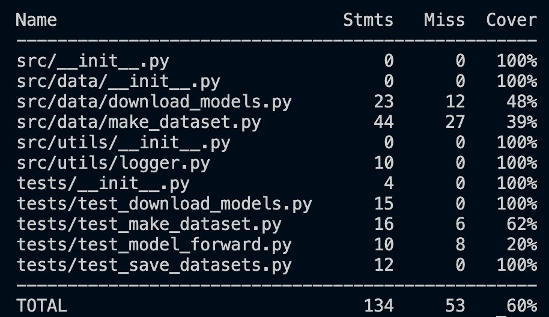
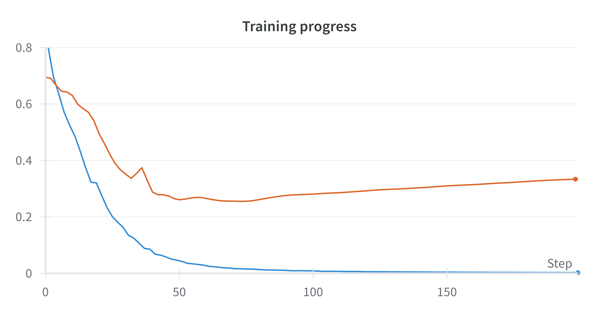
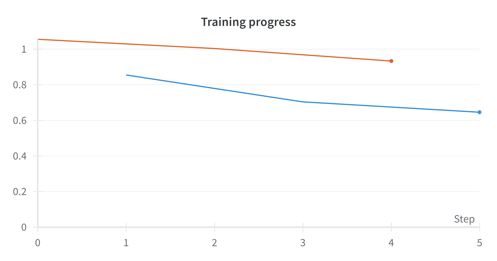
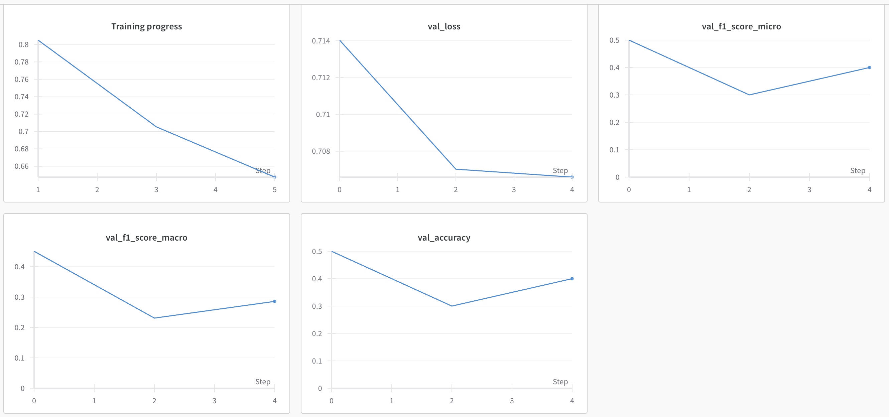
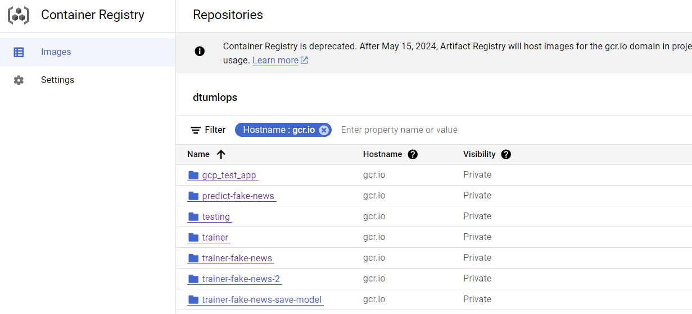
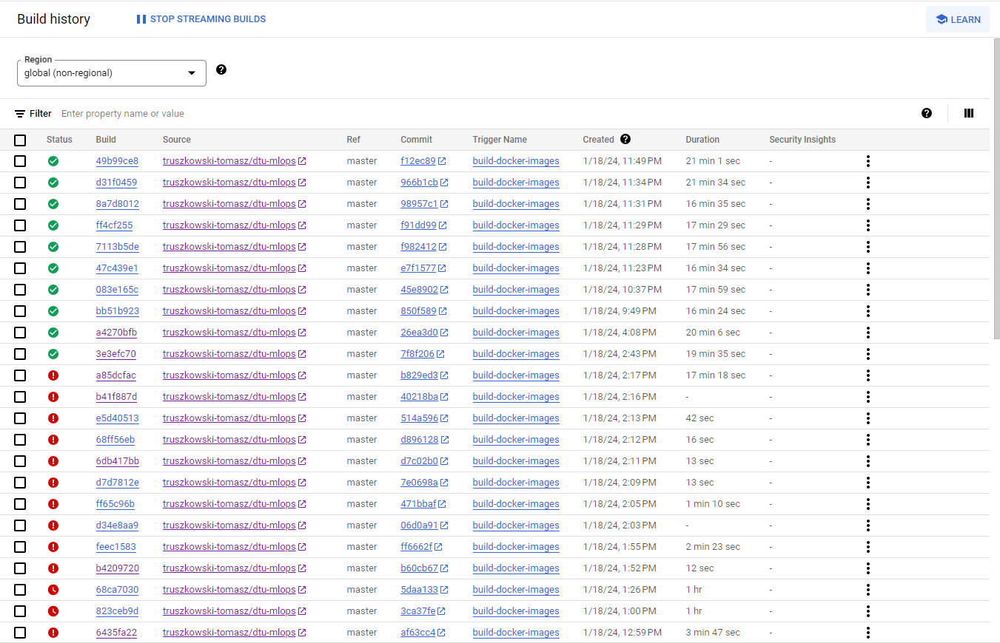

# Exam template for 02476 Machine Learning Operations

This is the report template for the exam. Please only remove the text formatted as with three dashes in front and behind
like:

```--- question 1 fill here ---```

where you instead should add your answers. Any other changes may have unwanted consequences when your report is auto
generated in the end of the course. For questions where you are asked to include images, start by adding the image to
the `figures` subfolder (please only use `.png`, `.jpg` or `.jpeg`) and then add the following code in your answer:

```markdown

```

In addition to this markdown file, we also provide the `report.py` script that provides two utility functions:

Running:

```bash
python report.py html
```

will generate an `.html` page of your report. After deadline for answering this template, we will autoscrape
everything in this `reports` folder and then use this utility to generate an `.html` page that will be your serve
as your final handin.

Running

```bash
python report.py check
```

will check your answers in this template against the constrains listed for each question e.g. is your answer too
short, too long, have you included an image when asked to.

For both functions to work it is important that you do not rename anything. The script have two dependencies that can
be installed with `pip install click markdown`.

## Overall project checklist

The checklist is *exhaustic* which means that it includes everything that you could possible do on the project in
relation the curricilum in this course. Therefore, we do not expect at all that you have checked of all boxes at the
end of the project.

### Week 1

* [X] Create a git repository
* [X] Make sure that all team members have write access to the github repository
* [X] Create a dedicated environment for you project to keep track of your packages
* [X] Create the initial file structure using cookiecutter
* [X] Fill out the `make_dataset.py` file such that it downloads whatever data you need and
* [X] Add a model file and a training script and get that running
* [X] Remember to fill out the `requirements.txt` file with whatever dependencies that you are using
* [X] Remember to comply with good coding practices (`pep8`) while doing the project
* [ ] Do a bit of code typing and remember to document essential parts of your code
* [X] Setup version control for your data or part of your data
* [X] Construct one or multiple docker files for your code
* [X] Build the docker files locally and make sure they work as intended
* [X] Write one or multiple configurations files for your experiments
* [X] Used Hydra to load the configurations and manage your hyperparameters
* [X] When you have something that works somewhat, remember at some point to to some profiling and see if
      you can optimize your code
* [X] Use Weights & Biases to log training progress and other important metrics/artifacts in your code. Additionally,
      consider running a hyperparameter optimization sweep.
* [X] Use Pytorch-lightning (if applicable) to reduce the amount of boilerplate in your code

### Week 2

* [X] Write unit tests related to the data part of your code (**partially**)
* [X] Write unit tests related to model construction and or model training (**partially**)
* [X] Calculate the coverage.
* [X] Get some continuous integration running on the github repository
* [X] Create a data storage in GCP Bucket for you data and preferable link this with your data version control setup
* [X] Create a trigger workflow for automatically building your docker images
* [X] Get your model training in GCP using either the Engine or Vertex AI
* [X] Create a FastAPI application that can do inference using your model
* [ ] If applicable, consider deploying the model locally using torchserve
* [ ] Deploy your model in GCP using either Functions or Run as the backend

### Week 3

* [ ] Check how robust your model is towards data drifting
* [ ] Setup monitoring for the system telemetry of your deployed model
* [ ] Setup monitoring for the performance of your deployed model
* [ ] If applicable, play around with distributed data loading
* [ ] If applicable, play around with distributed model training
* [ ] Play around with quantization, compilation and pruning for you trained models to increase inference speed

### Additional

* [X] Revisit your initial project description. Did the project turn out as you wanted?
* [X] Make sure all group members have a understanding about all parts of the project
* [X] Uploaded all your code to github

## Group information

### Question 1
> **Enter the group number you signed up on <learn.inside.dtu.dk>**
>
> Answer:

--- Group Number 10 ---

### Question 2
> **Enter the study number for each member in the group**
>
> Example:
>
>
>
> Answer:

--- s222937, s194768, s232858, s223219, s222703 ---


### Question 3
> **What framework did you choose to work with and did it help you complete the project?**
>
> Answer length: 100-200 words.
>
> Example:
> *We used the third-party framework ... in our project. We used functionality ... and functionality ... from the*
> *package to do ... and ... in our project*.
>
> Answer:

--- We have used the PyTorch framework in our project along with the PyTorch Lightning interface, which is built on top PyTorch framework.
In our project, we have used the many functionalities provided by the PyTroch framework such as the torch.utils.data package to process our dataset (in conjunction with Pandas),
the Tensor functionality from the Torch library to process our data as tensors, the nn library from PyTorch to create and manipulate our model and its layers (along with the BERT transformer that we have utilized from Huggingface 🤗). In addition to this we have used numerous other functionalities from other packages such as Pytest to test our scripts, Hydra to keep track of hyperparameters, wandb to log our model's performance, to name a few. As mentioned, we have used PyTorch Lightning to reduce the amount of boiler plate code around our project as well. ---

## Coding environment

> In the following section we are interested in learning more about you local development environment.

### Question 4

> **Explain how you managed dependencies in your project? Explain the process a new team member would have to go**
> **through to get an exact copy of your environment.**
>
> Answer length: 100-200 words
>
> Example:
> *We used ... for managing our dependencies. The list of dependencies was auto-generated using ... . To get a*
> *complete copy of our development environment, one would have to run the following commands*
>
> Answer:

--- Our project is overall very well structured. We have managed the dependencies of our project automatically using requirements files and package manager `pip`. Everytime we make a significant change in our project, such as adding functionality from a previously unused package, we update our requirements.txt and/or requirements_dev.txt file. For anyone to get a copy of our development environment, they could run the following commands in terminal:

1. make create_environment - Creates a new virtual environment using python 3.11
2. make requirements - installs all the dependencies needed for the app to work
3. gcloud auth login - logs into and authenticates to your google account
4. dvc pull - pulls all necessary data and model from a bucket in google cloud storage (set to be available for everyone)
5. At this point you are ready to use deployed model for Fake News prediction!

Note: This project uses wandb for tracking all the metrics during the training. Therefore, anyone willing to use our script for training model needs to get relevant `WANDB_API_KEY`. ---

### Question 5

> **We expect that you initialized your project using the cookiecutter template. Explain the overall structure of your**
> **code. Did you fill out every folder or only a subset?**
>
> Answer length: 100-200 words
>
> Example:
> *From the cookiecutter template we have filled out the ... , ... and ... folder. We have removed the ... folder*
> *because we did not use any ... in our project. We have added an ... folder that contains ... for running our*
> *experiments.*
> Answer:

--- The cookiecutter template has been extremely useful in our project. It gave us the freedom to focus on actual implementations of code, configurations and dependency management for the project. The directory structure is quite intuitive and project functionality is stored in similarly named folders. In our project, "src" is the main directory of our project. It contains code that forms the backbone of our model such as scripts for data processing, model training and predictions. Inside the "src" directory, the only unused directory is the "visualizations" since we have used Weights&Biases API to automatically log and visualize our experiments. The "models" directory contains the trained models our finely tuned model. The "tests" directory contains files that we have used for testing the fundamental functionality of our project such as downloading the project, making the dataset etc. For monitoring our project, we have the "logs" directory. The "notebooks" folder has been unutilized so far in the project, however it can be very useful to house Jupyter notebooks which can be used to demonstrate our project. To make sure that our project was reproducible, we have utilized Docker and the directory named "dockerfiles" contains the files that create an image for the training and prediction part of our model. 

There are many files throughout our project that are either incharge of performing a task or logging information for it. These files include (but arent limited to), docker-compose.yaml, cloudbuild.yaml and the files housed within .github folder. ---

### Question 6

> **Did you implement any rules for code quality and format? Additionally, explain with your own words why these**
> **concepts matters in larger projects.**
>
> Answer length: 50-100 words.
>
> Answer:

--- We implemented rules for code quality and formatting through pre-commit configuration. We are using standard pre-commit hooks:
      - id: end-of-file-fixer
      - id: trailing-whitespace
      - id: check-docstring-first
      - id: check-executables-have-shebangs
      - id: check-case-conflict
      - id: detect-private-key

Also, in order to follow `pip-8` standard, we are also using ruff hooks for linting and code formating.
In large projects, consistent code quality and format are vital as they lead to a more maintainable and understandable codebase, reduce the risk of introducing errors, and make collaboration easier. Uniform code standards help ensure that any developer can quickly read and contribute to the code, regardless of the project's scale. ---

## Version control

> In the following section we are interested in how version control was used in your project during development to
> corporate and increase the quality of your code.

### Question 7

> **How many tests did you implement and what are they testing in your code?**
>
> Answer length: 50-100 words.
>
> Example:
> *In total we have implemented X tests. Primarily we are testing ... and ... as these the most critical parts of our*
> *application but also ... .*
>
> Answer:

--- We have implemented 4 tests, and 2 of them are part of the automatic pipeline. We are testing the following:

1. Downloading dataset
2. Making dataset
3. Forward pass of model
4. Saving dataset.

We have focused on deploying docker images, data and running the training in the cloud, therefore, our implemented tests are a rudimentary. Due to issues with with access to the model from the github actions workflow we have decided to comment out 2 of them - making the dataset (uses local tokenizer) and forward pass (using fine tuned model). ---


### Question 8

> **What is the total code coverage (in percentage) of your code? If you code had an code coverage of 100% (or close**
> **to), would you still trust it to be error free? Explain you reasoning.**
>
> Answer length: 100-200 words.
>
> Example:
> *The total code coverage of code is X%, which includes all our source code. We are far from 100% coverage of our **
> *code and even if we were then...*
>
> Answer:

--- Taking into consideration all the tests we have 60% of coverage. Two of the tests that are being commented out (what is described in question 7), do not cover everything they should. In order to achive higher coverage appropriate would be to mock those test to not relay on either locally stored or remotly stored data and models. Code fully covers downloading of dataset, models and saving the dataset in the form of TensorDataset objects. 


---

### Question 9

> **Did you workflow include using branches and pull requests? If yes, explain how. If not, explain how branches and**
> **pull request can help improve version control.**
>
> Answer length: 100-200 words.
>
> Example:
> *We made use of both branches and PRs in our project. In our group, each member had an branch that they worked on in*
> *addition to the main branch. To merge code we ...*
>
> Answer:
> 
--- Our process of contributing to the project was also well structured. Members of the group have utilized branches to make their contributions. The general branch labelling convention followed "group_member_name/contribution". To merge individual contributions into the main project, we have utilized Pull Requests (PR), and one or more group members must review the PR before it can be allowed to merge into the main branch (master in our project due to technical reasons). ---

### Question 10

> **Did you use DVC for managing data in your project? If yes, then how did it improve your project to have version**
> **control of your data. If no, explain a case where it would be beneficial to have version control of your data.**
>
> Answer length: 100-200 words.
>
> Example:
> *We did make use of DVC in the following way: ... . In the end it helped us in ... for controlling ... part of our*
> *pipeline*
>
> Answer:
> 
--- We have used DVC to implement data version control in our project. The data for our project has been accquired from Kaggle and it is unlikely that there may be many changes to the data itself. However, it is a critical part of our project pipeline, as it allows to make sure that once a project member has set up the project locally, they can get the exact same data as everyone else to train the model on.  ---


### Question 11

> **Discuss you continues integration setup. What kind of CI are you running (unittesting, linting, etc.)? Do you test**
> **multiple operating systems, python version etc. Do you make use of caching? Feel free to insert a link to one of**
> **your github actions workflow.**
>
> Answer length: 200-300 words.
>
> Example:
> *We have organized our CI into 3 separate files: one for doing ..., one for running ... testing and one for running*
> *... . In particular for our ..., we used ... .An example of a triggered workflow can be seen here: <weblink>*
>
> Answer:

--- Our CI setup is configured within GitHub Actions workflows to ensure that every change to the codebase is automatically tested and validated. Github Actions consist of two workflows - first one executes all the unit tests using pytest framework to validate that all components of our application behave as expected. Second, using ruff, enforce coding standards and style consistency across the project.

Currently, our CI pipeline is set to run on the latest Ubuntu OS with Python 3.11. We have not configured the workflow to test across multiple operating systems or multiple versions of Python, but this can be a future enhancement to ensure broader compatibility.

We do make use of caching to speed up the CI process, particularly for dependencies. Caching saves time on subsequent runs by reusing the previously saved cache, which avoids redundant steps like re-downloading and reinstalling packages. The link to the workflow: ---

## Running code and tracking experiments

> In the following section we are interested in learning more about the experimental setup for running your code and
> especially the reproducibility of your experiments.

### Question 12

> **How did you configure experiments? Did you make use of config files? Explain with coding examples of how you would**
> **run a experiment.**
>
> Answer length: 50-100 words.
>
> Example:
> *We used a simple argparser, that worked in the following way: python my_script.py --lr 1e-3 --batch_size 25*
>
> Answer:

--- We used Hydra configuration files to systematically organize our hyperparameters, file paths, and other adjustable parameters that may need to be easily modified. The structure is designed to have one dedicated configuration file per task. For instance, there is a configuration file for preprocessing and data split, another for model creation, a separate one for training, and finally, one for prediction. While the initial setup predominantly follows a one-file-per-task convention, certain scripts may pull parameters from more than one configuration file when necessary. Due to time constraints, there is still some hardcoding in the project, but solving this would be trivial since it is just an extension of what we have  learned to do in this project. ---

### Question 13

> **Reproducibility of experiments are important. Related to the last question, how did you secure that no information**
> **is lost when running experiments and that your experiments are reproducible?**
>
> Answer length: 100-200 words.
>
> Example:
> *We made use of config files. Whenever an experiment is run the following happens: ... . To reproduce an experiment*
> *one would have to do ...*
>
> Answer:
  
--- To ensure reproducibility in our experiments, we employed a combination of config files, and environment management. Whenever an experiment is run, we use hydra framework configuration files that specify all parameters. This setup allows for precise control over the experiment settings and easy adjustment without modifying the code. Each experiment's configuration is saved alongside its results, providing a clear record of the conditions under which it was run.


To reproduce an experiment, one would need to use the same configuration file and ensure that the environment (Python version, library versions, etc.) matches the original setup. We manage our environment using tools like pip and requirements.txt (or conda with an environment.yml file) to specify exact package versions. Additionally, we use Docker containers to encapsulate the entire runtime environment, ensuring that experiments can be run with the same setup anywhere.

This approach of using config files, precise dependency management, and containerization helps to eliminate variations in the experimental setup, thereby ensuring that our experiments are reproducible by anyone with access to the configuration and environment details. ---

### Question 14

> **Upload 1 to 3 screenshots that show the experiments that you have done in W&B (or another experiment tracking**
> **service of your choice). This may include loss graphs, logged images, hyperparameter sweeps etc. You can take**
> **inspiration from [this figure](figures/wandb.png). Explain what metrics you are tracking and why they are**
> **important.**
>
> Answer length: 200-300 words + 1 to 3 screenshots.
>
> Example:
> *As seen in the first image when have tracked ... and ... which both inform us about ... in our experiments.*
> *As seen in the second image we are also tracking ... and ...*
>
> Answer:

--- We did a lot of experiments, and many of them were tracked because wandb had been implemented into our project from early on. Some of them were performed locally and therefore with a limited number of epochs and only small subset of data was used. In the images below, there can be seen - training progress for a large subset of the data and 150 epochs, progress for just a few dozen examples and 5 epochs, and the full set of metrics we tracked (Validation loss, Train loss, micro f1, macro f1, validation accuracy) respectively. The orange colour represents Validation loss and the blue colour represents Training loss.







Training and validation loss represent how well our model is performing, respectively on the training data and validation data. Validation data is needed to make sure that we do not overfit model to the training dataset. This way we make sure model generalizes well to new, unseen data. Micro F1 combines precision and recall but it is useful especially for multiclass classification as it reflects model ability to classify instances across all the classes. Macro, on the other hand is more helpful to understand classification of each class individually. Validation accuracy gives general overview predictions on validation set. It's important as it helps to easily see and understand how model performs on unseen data. ---

### Question 15

> **Docker is an important tool for creating containerized applications. Explain how you used docker in your**
> **experiments? Include how you would run your docker images and include a link to one of your docker files.**
>
> Answer length: 100-200 words.
>
> Example:
> *For our project we developed several images: one for training, inference and deployment. For example to run the*
> *training docker image: `docker run trainer:latest lr=1e-3 batch_size=64`. Link to docker file: <weblink>*
>
> Answer:

--- We utilized Docker images to streamline and standardize our training process, particularly for running jobs on the cloud. Initially, in our project, once a model was trained, we were building docker images locally on our machine. As the size of images grows, it becomes unfeasible to build images locally and then share them manually by uploading them somewhere. As we are creating separate images for the training and prediction part, it only reinforced the need for continuous integration and automatic building of the docker images on Cloud Build. Once the images are building, it is simply a matter of copying the pull command from Google Cloud Build and the image will be downloaded on any local machine running docker. To run our images, for instance, the trainer, `docker run trainer:latest`. We spend a considerable amount of time and effort into making sure that the automatic pipeline for creation of these images in Cloud Build worked correctly. As soon as any change is merged into the main branch of our project repository, a trigger on GCP is activated and begins creating new images for both trainer and predict using the cloud-builder. ---

### Question 16

> **When running into bugs while trying to run your experiments, how did you perform debugging? Additionally, did you**
> **try to profile your code or do you think it is already perfect?**
>
> Answer length: 100-200 words.
>
> Example:
> *Debugging method was dependent on group member. Some just used ... and others used ... . We did a single profiling*
> *run of our main code at some point that showed ...*
>
> Answer:

--- Debugging method was dependent on each group member. Some just used IDE debugging tools and others used internet help together with the error trace.
We did a single profiling run of our training code (see output below) just after adding boilerplate that showed how the backpropagation step was the most compute-intensive part, which is the usual during the training of a deep learning model. Some possible optimizations are making the model architecture simpler or using combined floats.
The second most consuming "winapi.WaitForMultipleObjects" suggests that our script spends a significant amount of time waiting for some OS-level operations. These are likely related to synchronization or I/O operations, such as data loading or saving. And after analysis of code we consider we already make optimum use of data loading, logging verbosity, and model checkpoint save, and that is common that it takes time in these matters.
One optimization that we used in order to save time during transformations, was to store the data as tensors.
Finally, as for memory usage, the sections that consume the most memory are the model loading and training, which is expected for these big models.

 ---

## Working in the cloud

> In the following section we would like to know more about your experience when developing in the cloud.

### Question 17

> **List all the GCP services that you made use of in your project and shortly explain what each service does?**
>
> Answer length: 50-200 words.
>
> Example:
> *We used the following two services: Engine and Bucket. Engine is used for... and Bucket is used for...*
>
> Answer:

In our project, we made use of the following Google Cloud Platform (GCP) services, each playing a crucial role in our machine learning workflow:

Cloud Storage (GCS): Hosted our data that was version-controlled with DVC, providing robust and scalable storage for datasets and model artifacts.

Cloud Build: Configured to automatically build a new container image for training whenever code was pushed to the main branch of our repository, ensuring that our training environment was always up-to-date.

Container Registry: Stored the container images created by Cloud Build, serving as a private repository for our Docker images.

Vertex AI: Utilized for submitting custom training jobs using the container images from Container Registry, which allowed us to train our models on scalable infrastructure.

Compute Engine: Employed for initial testing and running experiments on the cloud before scaling up , providing customizable and on-demand virtual 

Cloud Run: We have a job that is run once Cloud Build has finished building the trainer image and a continuous service that makes our API avaialable to use the predict feature of our model.

Billing: Although overlooked, it is an important service that was regularly checked to see how fast we burned through our credits while using the cloud services. ---

### Question 18

> **The backbone of GCP is the Compute engine. Explained how you made use of this service and what type of VMs**
> **you used?**
>
> Answer length: 100-200 words.
>
> Example:
> *We used the compute engine to run our ... . We used instances with the following hardware: ... and we started the*
> *using a custom container: ...*
>
> Answer:

--- Before setting up VertexAI, we used GCE to train the models, for example the one with 150 epochs shown above in the W&B experiments. The used machine was a "n2-standard-8" with 16GB of ram and 8 CPU's, since smaller machines we tried killed the process during trarining for resourse usage excess.

For model deployment, hosting our FastAPI server on a Compute Engine VM was a possibility. Yet, we recognized that this option might incur higher costs and offer less scalability compared to serverless alternatives like Cloud Run, which would be our preferred choice for such needs. Cloud Run provides a managed environment that automatically scales based on traffic, making it a more cost-effective and flexible solution for deploying containerized applications like ours. Additionally, we created a Deep Learning VM which we utilized to test the docker images as a test/deployment machine. ---

### Question 19

> **Insert 1-2 images of your GCP bucket, such that we can see what data you have stored in it.**
> **You can take inspiration from [this figure](figures/bucket.png).**
>
> Answer:


### Question 20

> **Upload one image of your GCP container registry, such that we can see the different images that you have stored.**
> **You can take inspiration from [this figure](figures/registry.png).**
>
> Answer:



### Question 21

> **Upload one image of your GCP cloud build history, so we can see the history of the images that have been build in**
> **your project. You can take inspiration from [this figure](figures/build.png).**
>
> Answer:

---  ---

### Question 22

> **Did you manage to deploy your model, either in locally or cloud? If not, describe why. If yes, describe how and**
> **preferably how you invoke your deployed service?**
>
> Answer length: 100-200 words.
>
> Example:
> *For deployment we wrapped our model into application using ... . We first tried locally serving the model, which*
> *worked. Afterwards we deployed it in the cloud, using ... . To invoke the service an user would call*
> *`curl -X POST -F "file=@file.json"<weburl>`*
>
> Answer:

--- Our model is served using FastAPI. We spent a considerable effort debugging to make sure that our model was deployed correctly and obviously we made sure that it was served correctly on our local environment. This has been achieved. However, the goal we really pushed for was deploying the model as a service on GCP using Cloud Run. We believe we have reached very close to having a working deployed model on Cloud Run, as we have a successfully running service. However, the only problem is that it returns an "Internal Server Error". ---

### Question 23

> **Did you manage to implement monitoring of your deployed model? If yes, explain how it works. If not, explain how**
> **monitoring would help the longevity of your application.**
>
> Answer length: 100-200 words.
>
> Example:
> *We did not manage to implement monitoring. We would like to have monitoring implemented such that over time we could*
> *measure ... and ... that would inform us about this ... behaviour of our application.*
>
> Answer:

--- We have been unable to implement monitoring in our project but we appreciate its importance. It is no secret that machine learning models degrade over time and it is crucial for value generation that the performance of the model is kept under close observation. This allows us to view information that could lead us to improving the model itself, debugging it in case it fails or simply log its performance. Issues, such as data drifting, can arise on a previously "good" working model if it is asked to make predictions about data which is outside the scope of data on which it was trained. Logs, metrics and event triggers such as alert systems are all part of monitoring apparatus that can be used to check a model's performance. ---

### Question 24

> **How many credits did you end up using during the project and what service was most expensive?**
>
> Answer length: 25-100 words.
>
> Example:
> *Group member 1 used ..., Group member 2 used ..., in total ... credits was spend during development. The service*
> *costing the most was ... due to ...*
>
> Answer:

--- Àiax used $26.84, Tomasz used $50.03, Shah used ~$50 and in total $76.85 credits was spend during development. The highest costing services were the Compute Engine and Cloud Build, due to the high use of CPU and memory during training and for trying to debug issues with automatic image building on Cloud Build. ---

## Overall discussion of project

> In the following section we would like you to think about the general structure of your project.

### Question 25

> **Include a figure that describes the overall architecture of your system and what services that you make use of.**
> **You can take inspiration from [this figure](figures/overview.png). Additionally in your own words, explain the**
> **overall steps in figure.**
>
> Answer length: 200-400 words
>
> Example:
>
> *The starting point of the diagram is our local setup, where we integrated ... and ... and ... into our code.*
> *Whenever we commit code and puch to github, it auto triggers ... and ... . From there the diagram shows ...*
>
> Answer:

--- question 25 fill here ---

### Question 26

> **Discuss the overall struggles of the project. Where did you spend most time and what did you do to overcome these**
> **challenges?**
>
> Answer length: 200-400 words.
>
> Example:
> *The biggest challenges in the project was using ... tool to do ... . The reason for this was ...*
>
> Answer:

--- One of the major struggles in our project was the integration and orchestration of various cloud services and tools to establish a smooth workflow. We dedicated a substantial amount of time to setting up and configuring our CI/CD pipeline, ensuring our machine learning models were automatically trained and evaluated upon each code push.

This was challenging due to the distinct configurations and nuances of each tool, requiring a deep understanding of their APIs and operational models. Additionally, managing data across services with DVC while ensuring data privacy and security added complexity.

We heavily relied on documentation, community forums, and support channels to overcome these challenges. Implementing Infrastructure as Code (IaC) practices enabled us to manage cloud resources programmatically, leading to reproducible setups and simplifying change tracking and rollbacks.

Optimizing our machine learning models for performance and cost was another significant hurdle. Cloud training can be expensive, and our models' early iterations were not efficient. Profiling models, identifying bottlenecks, and refining architectures improved performance and reduced resource utilization.

Team coordination and maintaining a consistent development environment were universal challenges. Using Docker to containerize our environment ensured every team member worked with an identical setup, avoiding the "it works on my machine" syndrome.

It's worth adding that we spent a lot of time struggling with DVC usage inside the cloud, leading to a workaround. Despite the struggles, the project was a valuable learning experience, enhancing our understanding of cloud services, DevOps skills, and the importance of monitoring and profiling in the machine learning lifecycle. ---

### Question 27

> **State the individual contributions of each team member. This is required information from DTU, because we need to**
> **make sure all members contributed actively to the project**
>
> Answer length: 50-200 words.
>
> Example:
> *Student sXXXXXX was in charge of developing of setting up the initial cookie cutter project and developing of the*
> *docker containers for training our applications.*
> *Student sXXXXXX was in charge of training our models in the cloud and deploying them afterwards.*
> *All members contributed to code by...*
>
> Answer:


--- Student s222703 was in charge of the profiling and training the model in GCP with VertexAI and Compute Engine.
  
Student s232858 chose to focus on managing and working with the GCP platform. 

Student s223219 implemented pytorch model and training loop (it was later wrapped up with pytorch-lightining), logger, script for downloading models from huggingface and fastapi app. Added some unit tests and created workflows for github actions as a CI part of project, he also added pre-commit and integrated weights&biases. Student also contributed to final report and helped to solve ongoing problems within GCP space. 

Student s222937 focused on training and prediction scripts using pytorch-lightning, adding hydra config files, setting up and troubleshooting the Cloud Run training job and prediction service. ---
